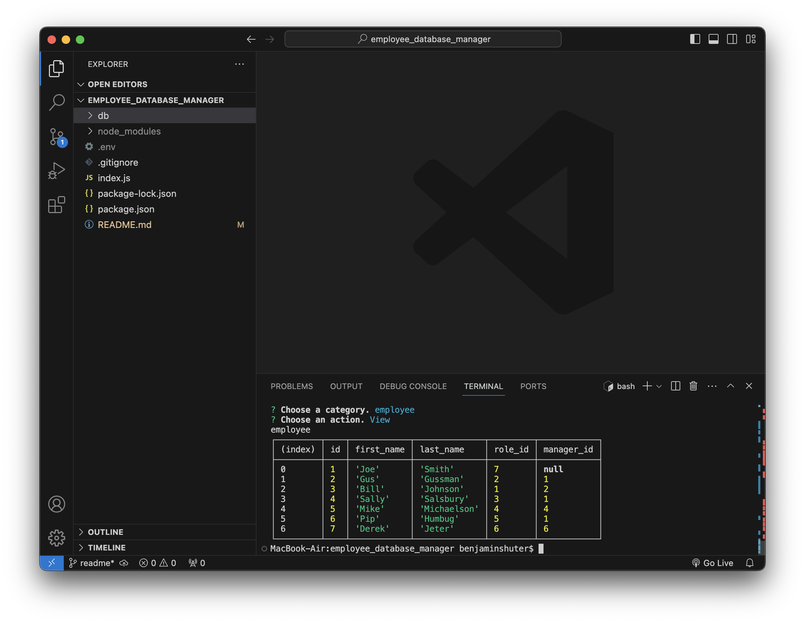

# employee_database_manager

## Description
This should be titled, "The Employee Database Viewer", because that's about all you can do on it.  This unfortunately is a non-functional app.  It is meant to be a CLI application that utilized NoneJS and Mysql to allow business owners to manage their employee.  The intention is to view, add, and remove departments, roles, and employees.  However, the only functioning part is viewing the tables.\
\
At least the tables look nice...

## Screenshots

## Video
[I'm shocked that this video came so close to 30 seconds.](https://drive.google.com/file/d/1abQzrUZD4CUmeG2GL_1yeQ4Q5OMnZXsV/view)